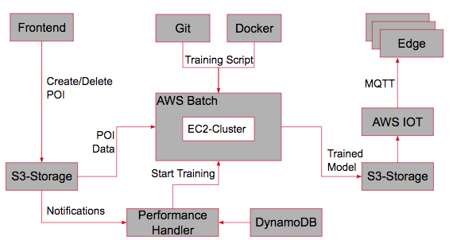

## Model Training in Batch Mode (Backend)

The [docker image](AWS_Batch/dockerfile) is used for the AWS Batch processing to train the model in the backend

AWS Batch dashboard: https://console.aws.amazon.com/batch/home?region=us-east-1#/dashboard

The process will be triggered via an event which is based on the individual bucket POI_IMAGES_BUCKET
- Input: Bucket1: POI_IMAGES_BUCKET; Bucket2: MODELS_BUCKET
- Processing: The AWS Batch job will create a model based on the POIs which are stored in the bucket: POI_IMAGES_BUCKET
- Output: Trained model which will placed in the bucket: MODELS_BUCKET

### Architecture Model Training

